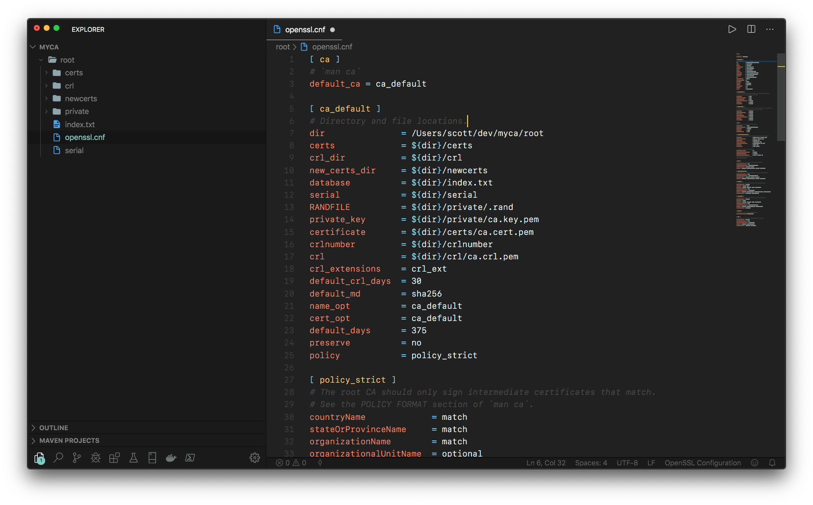

# Syntax Highlighting for OpenSSL Configuration Files

While hacking around on OpenSSL, I noticed that there didn't appear to be any syntax highlighting plugins for OpenSSL configuration files.

Given the syntax documented in the [OpenSSL man pages](https://www.openssl.org/docs/manmaster/man5/config.html), I have created a basic syntax for Visual Studio code that will highlight files.  Here's an example of how it looks for me:

## Contributions

I welcome any and all contributions to the project!  Pull requests welcome!

Enjoy :)
